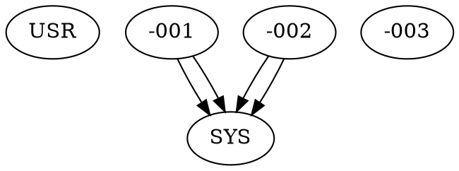

# Managing Relationships

As your requirements grow, the dependency graph becomes complex. This chapter covers strategies for managing intricate requirement relationships.

## Understanding Requirement Graphs

Requirements form a **directed acyclic graph (DAG)**:

- **Directed**: Parent-child relationships have a direction (child → parent)
- **Acyclic**: No circular dependencies (requirement A → B → C → A)
- **Graph**: Nodes (requirements) connected by edges (parent-child links)

*Note: Cycle detection is planned but not yet implemented. Currently, you must avoid cycles manually.*

## Hierarchical Levels

A typical hierarchy has 3-5 levels:

```
Stakeholder Needs
        ↓
User Requirements (USR)
        ↓
System Requirements (SYS)
        ↓
Software Requirements (SWR) / Hardware Requirements (HWR)
        ↓
Test Requirements (TST)
```

Each level derives from the one above and is verified by the one below.

## Complex Relationships

### Cross-Cutting Requirements

Some requirements affect multiple areas:

```
USR-001 (Login feature) ─┐
USR-002 (Data export)    ├─ SYS-042 (Logging)
USR-003 (Admin panel)    ┘

```

Logging satisfies needs from login (debug), export (audit), and admin (monitoring).

**Implementation**:

```bash
req create SYS --parent USR-001,USR-002,USR-003
```

### Derived Requirements

One parent spawns many children:

```
USR-001 (Secure authentication)
  ├─ SYS-001 (Password hashing)
  ├─ SYS-002 (Rate limiting)
  ├─ SYS-003 (Session management)
  └─ SYS-004 (OAuth support)
```

**Implementation**:

```bash
req create USR
req create SYS --parent USR-001  # SYS-001
req create SYS --parent USR-001  # SYS-002
req create SYS --parent USR-001  # SYS-003
req create SYS --parent USR-001  # SYS-004
```

### Composite Requirements

Multiple parents combine into one child:

```
SYS-010 (User data API)   ─┐
SYS-015 (Auth middleware) ─┼─ SWR-042 (Protected endpoint implementation)
SYS-022 (JSON serialization)─┘
```

**Implementation**:

```bash
req create SWR --parent SYS-010,SYS-015,SYS-022
```

## Traceability Queries

Finding relationships in a large requirement set:

### Find All Children of a Requirement

```bash
grep -l "hrid: USR-001" *.md
```

Lists all files that have USR-001 as a parent.

### Find All Parents of a Requirement

```bash
grep "hrid:" SYS-042.md | awk '{print $2}'
```

Extracts parent HRIDs from SYS-042.

### Find Requirements Without Parents

```bash
for file in SYS-*.md; do
  if ! grep -q "^parents:" "$file"; then
    echo "$file has no parents"
  fi
done
```

Identifies top-level requirements at a given level (might be an error).

### Find Requirements Without Children

```bash
for usr in USR-*.md; do
  hrid=$(basename "$usr" .md)
  if ! grep -q "hrid: $hrid" SYS-*.md; then
    echo "$hrid has no children"
  fi
done
```

Finds user requirements not satisfied by any system requirements (coverage gap).

## Avoiding Common Problems

### Circular Dependencies

**Problem**: A → B → C → A creates a cycle.

```bash
req link B A
req link C B
req link A C  # Creates cycle!
```

**Detection** (manual): Trace parent chains to ensure they terminate.

**Prevention**: Enforce strict hierarchy levels (USR → SYS → SWR → TST, never backward).

*Note: Automatic cycle detection is planned.*

### Orphaned Requirements

**Problem**: Requirements with no parents or children.

**USR with no children**: Unimplemented user needs (coverage gap).

**SYS with no parents**: Requirements without justification (why does this exist?).

**Detection**: Use the scripts above to find orphans.

### Wrong-Level Links

**Problem**: Skipping levels in the hierarchy.

```
USR-001 → SWR-042  # Skips SYS level!
```

**Prevention**: Enforce that USR links only to SYS, SYS links only to SWR, etc.

**Exception**: Sometimes justified in small projects, but generally avoided.

### Excessively Granular Links

**Problem**: Too many fine-grained requirements with complex links.

```
SYS-001 (Email validation)
  ├─ SWR-001 (Regex pattern)
  ├─ SWR-002 (Error message)
  ├─ SWR-003 (UI feedback)
  ├─ SWR-004 (Logging)
  └─ SWR-005 (Internationalization)
```

**Solution**: Combine related low-level requirements or accept coarser traceability.

## Refactoring Requirements

As understanding evolves, you may need to restructure:

### Splitting a Requirement

Original:

```
USR-001: Users shall authenticate and manage their profiles.
```

Split into:

```
USR-001: Users shall authenticate securely.
USR-002: Users shall manage their profile information.
```

**Process**:

1. Create new requirement (USR-002)
2. Update child requirements to link to appropriate parent
3. Update original requirement text
4. Mark as obsolete or delete if no longer needed

### Merging Requirements

Two requirements are redundant:

```
USR-001: Users shall export data.
USR-003: Users shall download reports.
```

**Process**:

1. Choose one to keep (USR-001)
2. Update its text to cover both concepts
3. Relink children of USR-003 to USR-001
4. Delete USR-003

### Reorganizing Hierarchy

Moving requirements between levels or namespaces:

**Before**:
```
SYS-042: OAuth integration
```

**After**:
```
AUTH-SYS-042: OAuth integration
```

**Process**:

1. Rename file: `mv SYS-042.md AUTH-SYS-042.md`
2. Run `req clean` to update HRIDs in child requirements
3. Manually update any external references (documentation, code comments)

## Documentation Strategies

### Requirement Specification Documents

Generate human-readable specs from requirements:

```bash
# Simple concatenation
cat USR-*.md > user-requirements.md
cat SYS-*.md > system-requirements.md
```

### Traceability Matrices

Create tables showing parent-child relationships:

| User Req | System Reqs |
|----------|-------------|
| USR-001 | SYS-001, SYS-002, SYS-003 |
| USR-002 | SYS-002, SYS-004 |
| USR-003 | SYS-005 |

Generate with scripts:

```bash
for usr in USR-*.md; do
  hrid=$(basename "$usr" .md)
  children=$(grep -l "hrid: $hrid" SYS-*.md | sed 's/.md//' | paste -sd,)
  echo "| $hrid | $children |"
done
```

### Visual Dependency Graphs

Use Graphviz to visualize relationships:

```bash
echo "digraph requirements {"
for file in *.md; do
  child=$(basename "$file" .md)
  grep "hrid:" "$file" | awk -v child="$child" '{print "  " $2 " -> " child}'
done
echo "}"
```

Output:



Render with:

```bash
./generate-graph.sh | dot -Tpng > requirements-graph.png
```

## Scalability Considerations

### Large Projects (100s of requirements)

- Use namespaces to partition by component
- Generate indexes and matrices automatically
- Consider directory structure: `auth/USR-*.md`, `payment/USR-*.md`

### Very Large Projects (1000s of requirements)

- Parallel loading (Requiem does this automatically)
- External database for complex queries
- Dedicated requirements management integration tools

### Multi-Product Families

- Shared requirements in `CORE-*`
- Product-specific in `MOBILE-*`, `WEB-*`, etc.
- Cross-reference shared requirements from product-specific ones

## Best Practices Summary

1. **Maintain strict hierarchy** - USR → SYS → SWR → TST
2. **Document cross-cutting concerns** - Explain why a requirement has many parents
3. **Avoid cycles** - Keep relationships acyclic
4. **Review orphans regularly** - Find requirements without links
5. **Refactor thoughtfully** - Restructure as understanding evolves
6. **Automate traceability checks** - Use scripts in CI
7. **Visualize complex graphs** - Generate diagrams for stakeholder review

## Real-World Example

See traceability in action in the [Example Project](../requirements.md), where you can explore:

- **USR-006** (Requirement Templates) traces to 5 system requirements (SYS-011 through SYS-015)
- **USR-004** (Graph Analysis) traces to 5 system requirements (SYS-004, 005, 008, 009, 010)
- Multiple requirements with single parents, demonstrating various relationship patterns

Browse the [User Requirements](../requirements/user-requirements.md) page to see the complete traceability tree visualized.

## Next Steps

Learn how to configure Requiem for your project in [Configuration](../configuration.md).
